# Jetson Nano TensorFlow Demo Instructions
## Flash the Jetson Nano

1. Download 
    - https://gumstix-yocto.s3.amazonaws.com/2020-01-14/jetson-nano/warrior/gumstix-console-image-jetson-nano.tegraflash.zip

2. Unzip the image you’ve downloaded into a folder
3. Download the device tree (.dtb) file for the **Gumstix Jetson Nano Dev Board from**: 
    - https://catalina-live.s3.amazonaws.com/public/bsp/BRD900000001101-R3/tegra210-p3448-0002-p3449-0000-b00.dtb
    - Replace the .dtb file in the image folder with the one you’ve just downloaded (make sure the name stays the same as the      original .dtb file)


    Note, that this demo also works for the Gumstix Jetson Nano Snapshot Board, as well as the Gumstix Jetson Nano MegaDrive board. 

    Download the device tree for the **Gumstix Jetson Nano Snapshot Board** from: 
    - https://catalina-live.s3.amazonaws.com/public/bsp/BRD900000001185-R2/tegra210-p3448-0002-p3449-0000-b00.dtb

    Download the device tree for the **Gumstix Jetson Nano Megadrive board** from:
    - https://catalina-live.s3.amazonaws.com/public/bsp/BRD900000001198-R1/tegra210-p3448-0002-p3449-0000-b00.dtb

There are 2 ways to flash the Jetson Nano. They are outlined in the next two sections.


### Flash the Jetson Nano using the Gumstix Jetson Nano Dev Board
Setup your Jetson Nano using the Gumstix Jetson Nano Dev Board as shown in the Figures below:

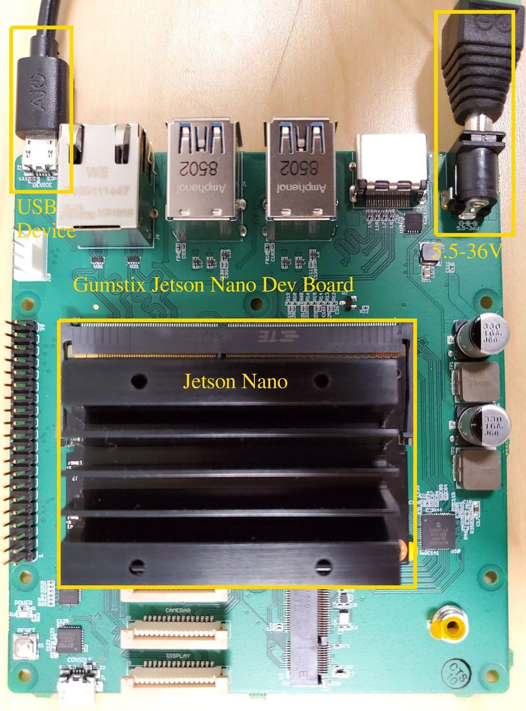
Figure 1: Topside of Gumstix Jetson Nano Dev Board configured for flashing

- Connect a USB Micro-B cable from your host machine to the the Micro-B jack labelled “DEVICE”
- Connect the Jetson Nano into the Jetson Nano slot
- Prepare a DC power adapter, with a voltage range between 5.5-36V (with ~12W capability for the TensorFlow demo), to connect to the Barrel connector on the top right of the board (don’t actually apply power yet though)

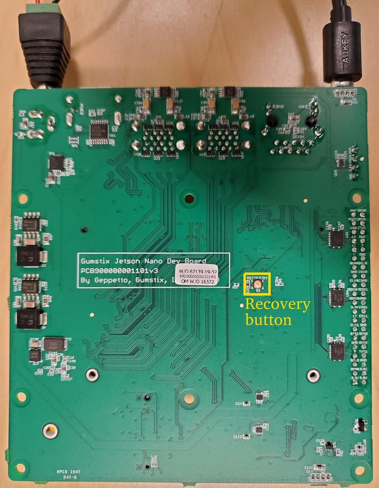
Figure 2: Bottom side of Gumstix Jetson Nano Dev Board configured for flashing. Recovery Button highlighted in yellow.

#### Running the flash script (Gumstix Jetson Nano Dev Board):
On your host machine, open a terminal in the folder/directory that you’ve extracted the Jetson Nano image to.
1. Press and hold the “Recovery” button on the bottom side of the Gumstix Jetson Nano Dev Board
2. Apply power by inserting the DC power adapter. Once you’ve powered up, you can let go of the “Recovery” button
3. In the terminal, run: 
```
$ sudo ./doflash.sh
```

You should start seeing activity on the terminal. If you get an output message that says “ERR: chip does not identify as tegra210 ()”, then the “Recovery” button wasn’t properly pressed when powering on, so try the entire process again starting at step 1. 

If it successfully flashes, you should see the terminal output a message that says “Flashing completed”. 

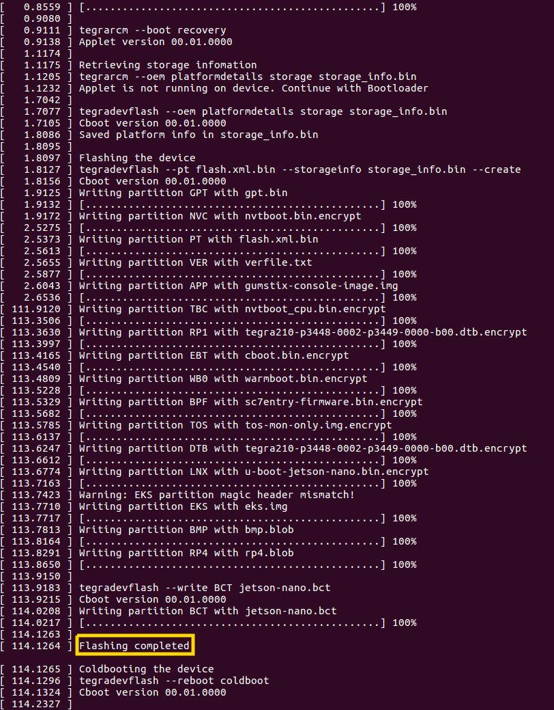
Figure 3: Output of terminal after successfully flashing the Jetson Nano

### Flash the Jetson Nano using Gumstix’s Jetson Nano Flasher 
This is an alternative method of flashing the Jetson Nano. Some may find it easier to flash the Jetson Nano with Gumstix’s Jetson Nano Flasher board because the “Recovery” button is a larger tactile switch. 

Orient your Jetson Nano Flasher board as shown in Figure 4, and setup your Jetson Nano as shown in Figure 5 below. 

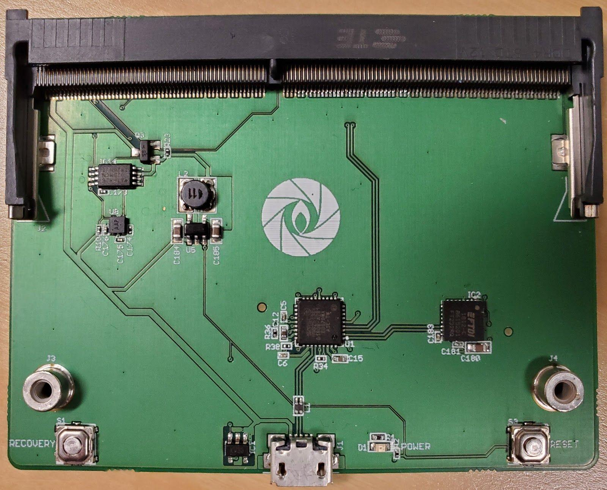
Figure 4: Gumstix’s Jetson Nano Flasher board

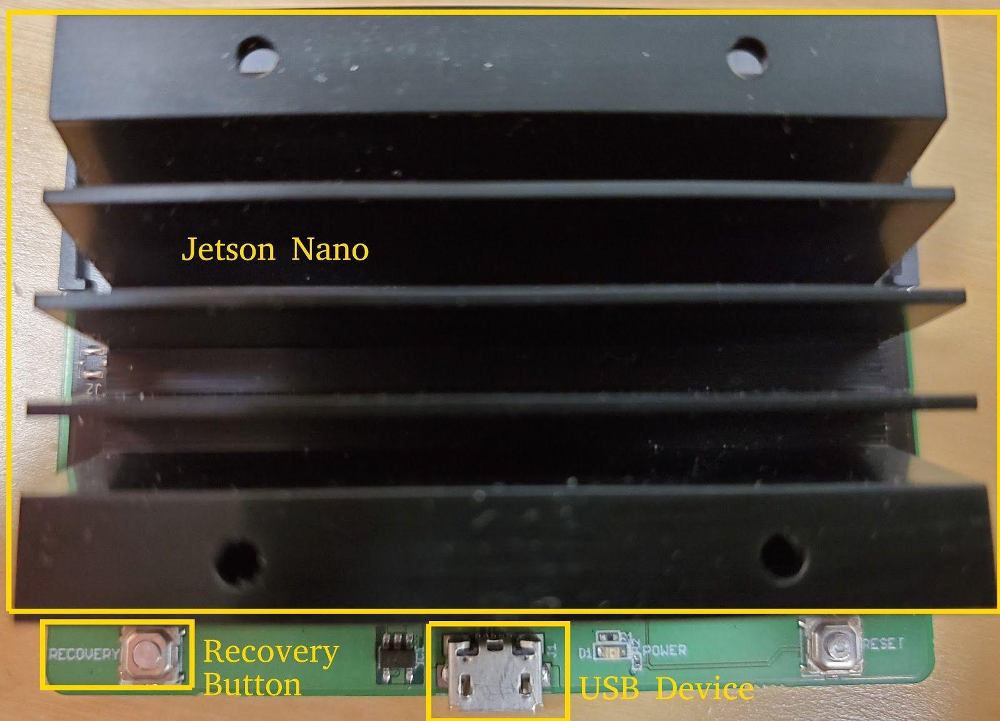
Figure 5: Jetson Nano Flasher board with the Jetson Nano installed

#### Running the flash script (Jetson Nano Flasher):
On your host machine, open a terminal in the folder/directory that you’ve extracted the Jetson Nano image to.
1. Press and hold the “Recovery” button on the bottom-left side of the Jetson Nano Flasher board
2. Connect a USB Micro-B connector from your host machine, to the USB Micro-B Jack on the Jetson Nano Flasher board. Once the power LED turns on, you can let go of the “Recovery Button”
3. In the terminal, run:
```
$ sudo ./doflash.sh
```

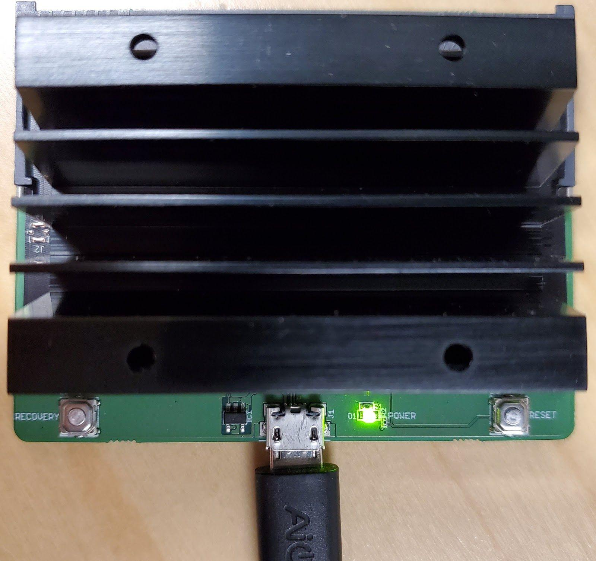
Figure 6: Jetson Nano Flasher board with USB Micro-B connected during flashing process

You should start seeing activity on the terminal. If you get an output message that says “ERR: chip does not identify as tegra210 ()”, then the “Recovery” button wasn’t properly pressed and held when powering on, so try the entire process again starting at step 1). 

If it successfully flashes, you should see the terminal output “Flashing completed” (See Figure 3 for reference).

## Test Camera Functionality
Setup your Gumstix Jetson Nano Dev Board as shown below in Figure 7 - connect ethernet, a monitor via HDMI, Jetson Nano, power adapter (5.5-36V), and a Raspberry Pi Camera V2.1 (to either camera slot will work). 

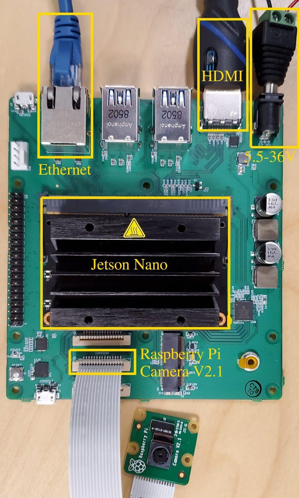
Figure 7: Configuration to test camera functionality

1. Power on the board
2. SSH into the Jetson Nano by running the following command in the terminal:
```
$ ssh root@jetson-nano.local
```
After answering “yes” to the prompts, you should see:
root@jetson-nano:~#
3. To stream video from the camera to the HDMI monitor, run the following command in the  SSH terminal:
```
# nvgstcapture-1.0
```

At this point, you should see the camera streaming video to the HDMI monitor. If you don’t, or you encounter an error, double check to make sure your Raspberry Pi Camera V2.1 cable is connected properly (the metal fingers should be facing towards the Jetson Nano, the blue strip should be facing towards the bottom edge of the board). 

## Setup the Gumstix Jetson Nano Dev Board for the TensorFlow Demo
Now that we’ve confirmed that the camera is working, we no longer need the HDMI monitor connected. You can set up your Gumstix Jetson Nano Dev Board as shown below in Figure 8.

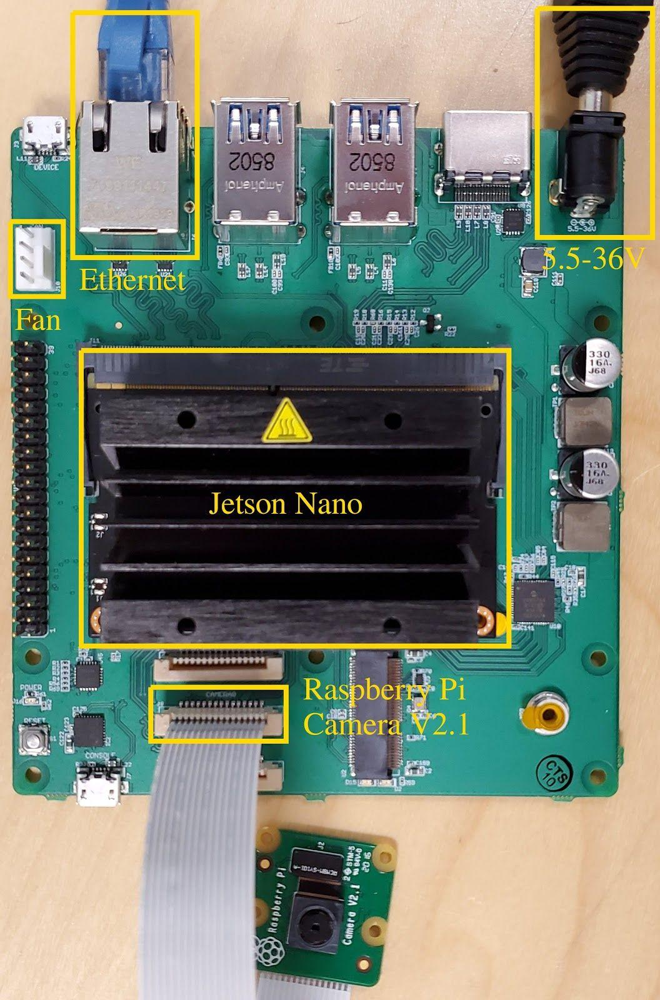
Figure 8: Gumstix Jetson Nano Dev Board setup for TensorFlow Demo

Power on the Gumstix Jetson Nano Dev Board. Once it’s booted up, SSH into the Jetson Nano by running the following command in a terminal on the host machine:
```
$ ssh root@jetson-nano.local
```
After answering “yes” to the prompts, you should see:
root@jetson-nano:~#
### Run a benchmark test for TensorFlow
To verify that TensorFlow is working on the Jetson Nano, run the following commands in the SSH terminal:
```
# nvpmodel -m 0
# jetson_clocks
# cd​ /usr/​ local​ /tensorflow-tools/benchmarks/scripts/tf_cnn_benchmarks/
# python3 tf_cnn_benchmarks.py --data_format=NHWC --device=gpu
```
You should see activity on the SSH terminal. If it completes correctly, you will see it output a metric of “total images/sec: ####.##”. 

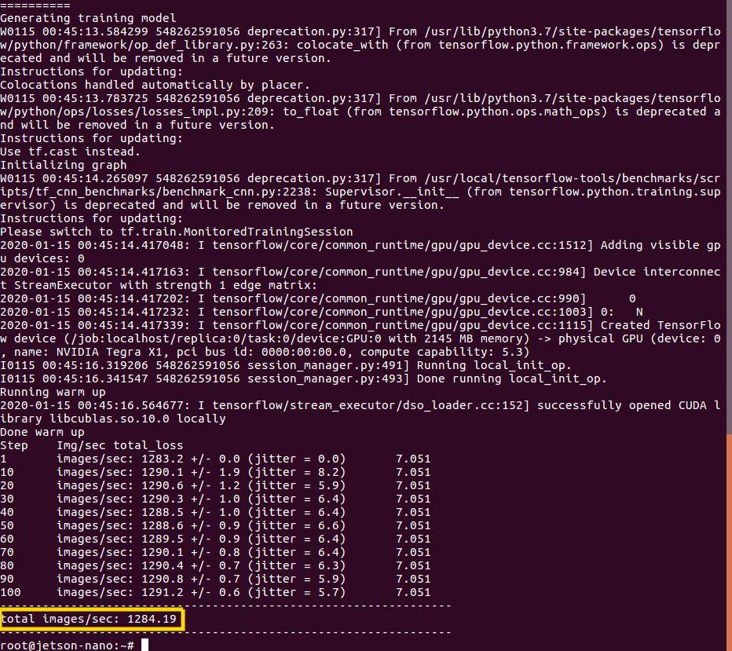
Figure 9: Expected output of Tensorflow benchmark
Note, you can compare the TensorFlow performance on the GPU to the CPU performance by changing the --device to “cpu”. Try running the following command:
```
# python3 /usr/local/tensorflow-tools/benchmarks/scripts/tf_cnn_benchmarks/tf_cnn_benchmarks.py --data_format=NHWC --device=cpu
```
You will notice, the CPU (~100 images/sec) performs an order of magnitude worse than the GPU (~1000 images/sec).

## Run the TensorFlow Demo
Now that we’ve verified that the camera and TensorFlow work, we can run the full TensorFlow demo. 
1. In the SSH terminal, run the following commands: 
```
# cd ~
# cd /usr/local/tensorflow-tools/tf_trt_models
# ./install.sh
```
If everything installs correctly, you will see “Finished processing dependencies for tf-trt-models==0.0”

2. On your host machine, open a new terminal and run the following command:
```
$  gst-launch-1.0 -v udpsrc port=5000 ! application/x-rtp,encoding-name=H264,payload=96 ! rtph264depay ! h264parse ! avdec_h264 ! autovideosink
```

3. In the SSH terminal, run TensorFlow and stream it back to your host machine by running the following command:
```
# python3 camera_tf_trt.py --model ssd_mobilenet_v1_coco --ip-address 192.168.xxx.yyy --stealth --build
```
Note, replace 192.168.xxx.yyy with your actual host machine’s IP address. 
(If you receive an error that looks like: “ModuleNotFoundError: No module named 'cycler'”, run the command “sudo pip3 install cycler”, and retry the TensorFlow command again)

You will have to wait a while, but eventually the video window will pop up on your host machine. 

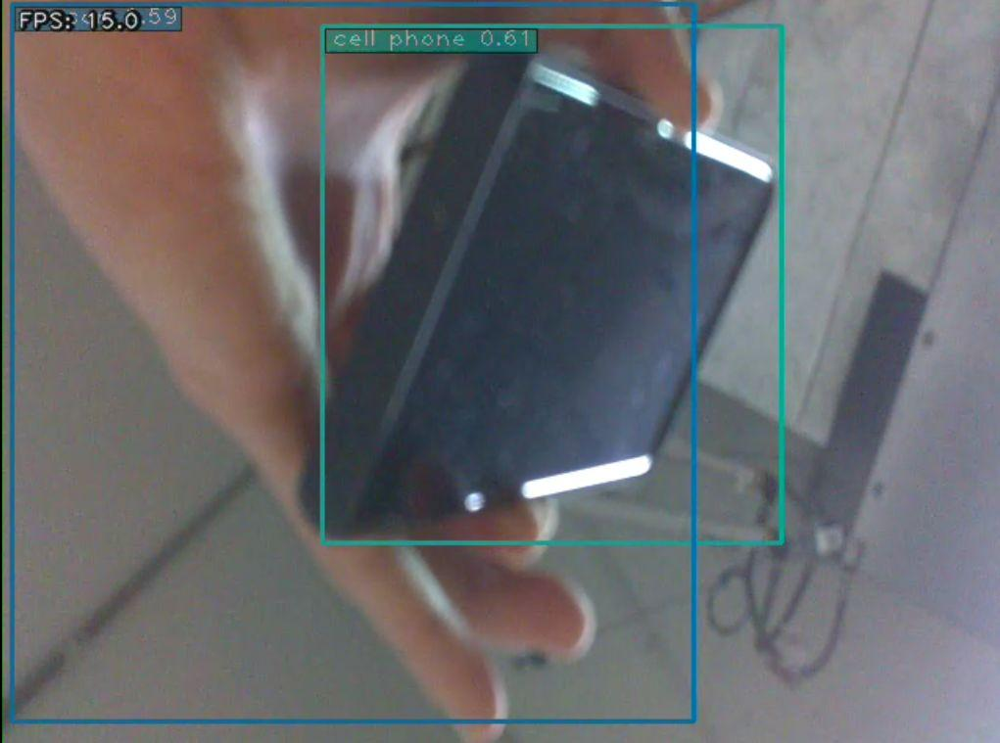
Figure 10: TensorFlow demo streamed to host machine


You only need to add “--build” for the first time that particular model is used. If the model has already been used, you can just use the command: 
```
# python3 camera_tf_trt.py --model ssd_mobilenet_v1_coco --ip-address <host_machine_IP_address> --stealth
```

## Add your own TensorFlow model
Let’s say you trained your own model, and want to test it out on the Jetson Nano. For example, we trained our own model for ego_hands (https://github.com/jkjung-avt/hand-detection-tutorial). 

1. Navigate to /usr/local/tensorflow-tools/tf_trt_models/data/ssd_mobilenet_v1_egohands by running the following commands:
```
# cd ~
# cd /usr/local/tensorflow-tools/tf_trt_models/data/ssd_mobilenet_v1_egohands
```

2. Download your model files. Run the following commands:
```
# wget https://gumstix-tensorflow.s3-us-west-2.amazonaws.com/ssd_mobilenet_v1_egohands/model.ckpt-20000.data-00000-of-00001
# wget https://gumstix-tensorflow.s3-us-west-2.amazonaws.com/ssd_mobilenet_v1_egohands/model.ckpt-20000.index
# wget https://gumstix-tensorflow.s3-us-west-2.amazonaws.com/ssd_mobilenet_v1_egohands/model.ckpt-20000.meta
```

3. On your host machine, open a new terminal and run the following command:
```
$  gst-launch-1.0 -v udpsrc port=5000 ! application/x-rtp,encoding-name=H264,payload=96 ! rtph264depay ! h264parse ! avdec_h264 ! autovideosink
```

4. Navigate to the /usr/local/tensorflow-tools/tf_trf_models folder. Run the TensorFlow program: 
```
# cd ~
# cd​ /usr/​ local​ /tensorflow-tools/tf_trt_models
# python3 camera_tf_trt.py --model ssd_mobilenet_v1_egohands --labelmap data/egohands_label_map.pbtxt --num-classes 1 --ip-address 192.168.xxx.yyy --stealth --build
```
Remember to replace 192.168.xxx.yyy with your actual host machine’s IP address. 

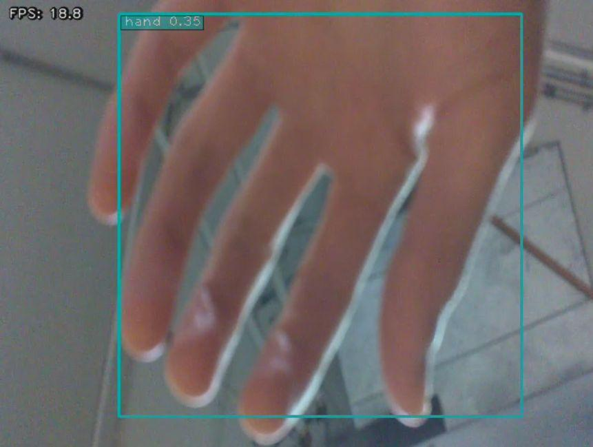
Figure 11: Expected output of the egohands demo

Again, you only need to add the “--build” option the first time you run the model. 


